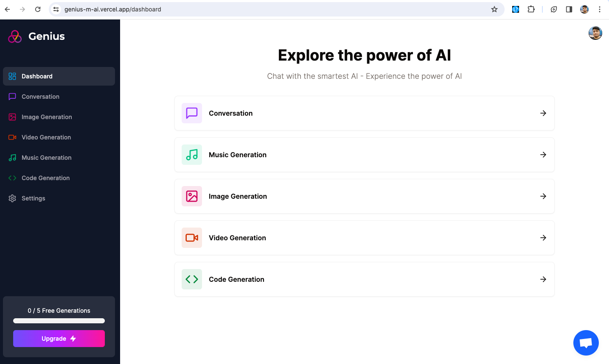

# Genius AI Platform with Next.js 13



This repository contains the source code for building a SaaS AI Platform with Next.js 13, React, Tailwind CSS, MongoDB, and Stripe. The platform offers various AI-powered tools for generating images, videos, conversations, and music.

## Features

- Tailwind CSS design with animations and effects
- Fully responsive layout
- Authentication with Clerk (Email, Google, and 9+ Social Logins)
- Client form validation using react-hook-form
- Server error handling with react-toast
- AI-powered tools:
  - Image Generation Tool (OpenAI)
  - Video Generation Tool (Replicate AI)
  - Conversation Generation Tool (OpenAI)
  - Music Generation Tool (Replicate AI)
- Page loading state
- Stripe monthly subscription integration
- Free tier with API limiting
- Routing with Next.js
- MongoDB integration for data storage

## Prerequisites

Ensure you have Node.js version 18.x.x installed on your machine.

## Installation

Install the required packages by running:

```shell
npm install
```

## Setup

Create a `.env` file in the root directory and configure the following environment variables:

```plaintext
NEXT_PUBLIC_CLERK_PUBLISHABLE_KEY=
CLERK_SECRET_KEY=
NEXT_PUBLIC_CLERK_SIGN_IN_URL=/sign-in
NEXT_PUBLIC_CLERK_SIGN_UP_URL=/sign-up
NEXT_PUBLIC_CLERK_AFTER_SIGN_IN_URL=/dashboard
NEXT_PUBLIC_CLERK_AFTER_SIGN_UP_URL=/dashboard

OPENAI_API_KEY=
REPLICATE_API_TOKEN=

MONGODB_URI=

STRIPE_API_KEY=
STRIPE_WEBHOOK_SECRET=

NEXT_PUBLIC_APP_URL=http://localhost:3000
```

## Usage

Start the development server by running:

```shell
npm run dev
```

## Available Commands

| Command | Description |
| ------- | ----------- |
| `dev`   | Starts a development instance of the app |

## Folder Structure

The repository follows a structured folder organization for better code management and scalability.


## License

This project is licensed under the MIT License. See the [LICENSE](LICENSE) file for details.

